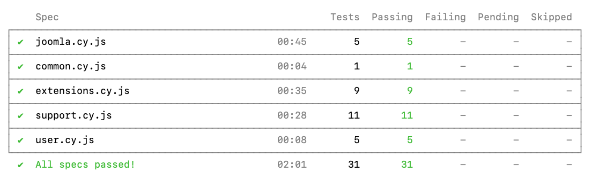
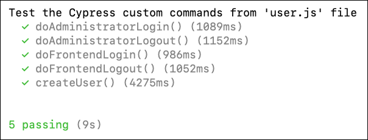

# Cypress Tests

The testing of the NPM module `joomla-cypress` is also implemented with Cypress.
Each Cypress custom command is executed at least once and the result is checked.

You can use [Joomla Branches Tester](https://github.com/muhme/joomla-branches-tester) (JBT)
to run the tests or use your own target Joomla installation.


## Running the Tests Using JBT

JBT has integrated the testing of the NPM module `joomla-cypress`.
In the `installation/joomla-cypress` directory the latest main branch version is already installed.
Furthermore Joomla, databases, Cypress and sample module are already provided with JBT.
Restoring the `installation`folder, running `npm ci` and handing over the
sample module for installation are covered for you.
This is implemented in the scripts `tests`, `cypress` and `patch`.

Patch `installation/joomla-cypress` e.g. with pull request `#37 Fixing installJoomlaMultilingualSite()`:
```
scripts/patch installation joomla-cypress-37
```

Running the test suite headless for Joomla 5.2:
```
scripts/test 52 joomla-cypress
```



Running only `user.cy.js` test spec file and watching the progress with NoVNC:
```
scripts/test 52 joomla-cypress cypress/user.cy.js novnc
```



Running the test suite for Joomla 5.3 and 6.0
without the `installLanguage` and `installJoomlaMultilingualSite` tests,
if the language package is not yet available, on Unix-based systems:

```
CYPRESS_SKIP_INSTALL_LANGUAGES=1 scripts/test 53 60 joomla-cypress 
```

Running tests with local Cypress GUI, e.g. on macOS or Linux:
```
scripts/cypress 52 joomla-cypress local
```

Running on Joomla 6.0 without the tests they install languages,
with the Cypress GUI, e.g. on Windows 11 WSL2 Ubuntu:
```
CYPRESS_SKIP_INSTALL_LANGUAGES=1 scripts/cypress 60 joomla-cypress
```

## Running the Tests Using Own Installation

Requirements:
* PHP (a Joomla-supported version)
* Composer
* NPM
* Cypress
* Web Server
* Joomla sources
* A database and PHP extensions for the database

Ensure Firefox is installed system-wide (check with `npx cypress info`).

For Joomla sources the following commands are sufficient:
```
git clone https://github.com/joomla/joomla-cms --depth 1
cd joomla-cms
composer install
npm ci
```
No additional configuration is needed, as the parameters
are set within `joomla-cypress` Cypress configuration.

> [!NOTE]
> The custom command `installJoomlaMultilingualSite` deletes the Joomla `installation` folder.
> You have to restore the `installation` folder after each test run,
> from saved copy or from GitHub and with recreating the `installation/template/css` folder:
> ```
> git checkout installation
> npm ci
> ```

### Installation

Install the JavaScript dependencies
```
git clone https://github.com/joomla-projects/joomla-cypress
cd joomla-cypress
npm ci
```

### Configuration

Create the Cypress configuration file from the distribution template.
```
cp cypress.config.dist.mjs cypress.config.mjs
```

Adapt the environment variables in the file `cypress.config.mjs`,
they should point to the site, user data and database environment.
Most configurations are the same as with Joomla System Tests `cypress.configuration.mjs` file.
Additional variables are
* `installationPath` contains the file system path to your Joomla installation
  (used to delete the `configuration.php` file before installing Joomla)
* `instance` specifies the Joomla major and minor version number, e.g. `53` for Joomla 5.3.

### Tests

Running all tests headless:

```
npm test
```

Running the test suite without the `installLanguage` and `installJoomlaMultilingualSite` tests,
if the language package is not yet available, on Windows PowerShell:
```
$env:CYPRESS_SKIP_INSTALL_LANGUAGES=1
npm test
```

Running only `user.cy.js` test spec file

```
npx cypress run --spec tests/cypress/user.cy.js
```

Running tests with local Cypress GUI:
```
npm run open
```

# Trouble-Shooting

1. Ensure that you have installed the version of `joomla-cypress` to be tested 
   and patched if necessary.
2. If one test step fails, the target Joomla installation may reach a state
   causes subsequent tests to fail. Dependecies include
   deleting Joomla `installation` folder, deleting the `configuration.php` file,
   cancelling guided tours and disabling Joomla statistics.
   In such cases open the target Joomla installation administration
   to investigate or reinstall the target Joomla sources.
3. For failed tests you can inspect the screenshoots in `tests/cypress/screenshoots` folder or
   run Cypresss GUI to observe the issue.
4. If the `installExtensionFromFolder()` test fails as the Joomla web server cannot
   find the `mod_hello_world` package folder, set the folder with the enviroment
   variable `CYPRESS_SERVER_UPLOAD_FOLDER`. For example on Unix-based systems:
   ```
   export CYPRESS_SERVER_UPLOAD_FOLDER=/users/alice/joomla-cypress/tests/cypress/fixtures/mod_hello_world
   ```
5. For Joomla development versions that are not yet been released,
   the tests `installLanguage` and `installJoomlaMultilingualSite`
   fail with the error message `Unable to detect manifest file`
   because the language packages are not yet available.
   Exclude these tests by setting an environment variable on Unix-based systems:
   ```
   export CYPRESS_SKIP_INSTALL_LANGUAGES=1
   ```
